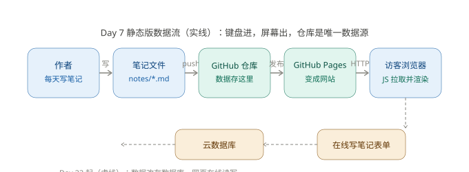

# TECH_DESIGN.md — 学习笔记站 技术设计（Day 5）

> 项目：学习笔记站 ｜ 版本：v1.0 ｜ 日期：2026-09-26
> 输入来源：`PRD.md`（eccee45）、`research.md`（cf46ae8）
> 本文只定技术路线，**不写代码**（代码从 Day 6 开始）。

## 1. 一句话说清数据从哪来、到哪去

> **我写的 Markdown 笔记通过 git push 存进 GitHub 仓库，GitHub Pages 把仓库发布成网站，访客浏览器打开网页后用 JS 拉取并渲染这些笔记——数据从我的键盘来，到访客的屏幕上去。**



文字版（图片打不开时看这里）：

```
[作者] --写--> [notes/*.md] --git push--> [GitHub 仓库] --自动发布--> [GitHub Pages]
                                                                      |
[访客浏览器] <--HTTPS 拉取 HTML+md 文件, JS 渲染-------------- [GitHub Pages]
（Day 23 起虚线扩展：在线表单 --> 云数据库，数据源从文件升级为数据库）
```

## 2. 前端、后端、数据库各管什么

| 角色 | 通俗理解 | 在本项目里的分工 |
|---|---|---|
| **前端** | 访客看到和操作的界面 | HTML/CSS 画出卡片、标签栏、关于区块；JS 负责"点卡片展开""点标签筛选" |
| **后端** | 在服务器上干活的程序 | **Day 7 版没有后端**——静态站不需要；Day 23 起用云函数/云服务接收表单写入 |
| **数据库** | 有序存放数据、随取随用 | **Day 7 版没有数据库**——GitHub 仓库里的 Markdown 文件就是数据源；Day 23 起笔记存入云数据库 |

关键认知：MVP 是"纯前端 + 文件当数据库"。这不是偷懒，是 PRD 砍掉登录和在线写入后的自然结果——**没有写入端用户，就不需要后端**。

## 3. 技术路线（一行版）

> **纯 HTML/CSS/原生 JS 单页 + Markdown 文件作数据源 + marked.js 渲染 + GitHub Pages 托管，Day 23 再接入云数据库。**

### 每个选择的理由

| 选择 | 理由 | 放弃了谁 |
|---|---|---|
| **原生 HTML/CSS/JS** | 零基础阶段每一行都看得懂，出错能定位；不引入 React/Vue 等框架的构建工具链 | Vue/React（要学 Node、打包，Day 7 前学不完） |
| **Markdown 文件 + Git 仓库当数据源** | 数据所有权归自己（研究结论）、发布即提交、天然有版本历史 | 数据库先行（PRD 已砍在线写入，Day 23 才需要） |
| **marked.js 渲染 Markdown**（CDN 引入） | 20KB 成熟库，一行代码把 .md 变成 HTML，不自己造轮子 | 手写解析器（细节坑多：转义、表格、代码块） |
| **GitHub Pages 托管** | 免费、和仓库一体 push 即发布、HTTPS 自带 | 买服务器/其他云（花钱且要学部署） |
| **云数据库（Day 23 再选型）** | 到时候按当天课程引入，避免提前锁死 | —— |

### 为什么暂时选这条路线（卡住降级条款备份）

这条路线的共同点：**全部工具今天已经在用**（Git、GitHub、Markdown）。零基础阶段最大风险不是"选得不够好"，而是"新工具太多学不过来"，所以优先复用已知工具，把学习成本压到最低。

## 4. 数据流分阶段说明

**Day 7（静态版）**：笔记 = `notes/` 目录下的 Markdown 文件（字段见 PRD 第 4 节，写在文件头部）。页面加载时 JS 拉取文件列表和内容 → marked.js 渲染 → 按日期倒序插入卡片。

**Day 23 起（数据库版）**：新增在线表单 → 云函数写入云数据库 → 页面改从数据库接口读数据。**文件版数据流保留作备份**，两种来源共存不冲突。

## 5. 余力加练：方案变化时哪些文件会受影响

| 如果将来要… | 受影响文件 | 说明 |
|---|---|---|
| 换 Markdown 渲染库 | `index.html`（改 CDN 引用一行） | 其余不动，渲染函数封装过 |
| 换托管平台 | 仓库设置 + `index.html` 无关 | GitHub Pages 是平台级配置 |
| Day 23 接入数据库 | 新增 `db.js`、改 `index.html` 数据加载部分 | `notes/*.md` 保留为备份 |
| 改笔记字段（如加"时长"） | 每个笔记文件的头部 + 渲染卡片处 | 字段定义只在两处出现 |
| 改配色/样式 | `style.css`（如拆分则只改它） | 样式与结构分离的好处 |

## 6. 附：什么是技术栈（余力加练笔记）

**技术栈** = 做一个产品要用的一整套技术的叠层总称，像盖房子：地基（托管/服务器）+ 框架（前后端语言和库）+ 水电（数据库）。

以本项目为例：
- **前端层**：HTML（结构）、CSS（外观）、JS（交互）——必选，浏览器只认这三个
- **工具层**：Git/GitHub（版本管理）、marked.js（Markdown 渲染库）
- **托管层**：GitHub Pages（免费发布）
- **数据层**：现阶段文件，Day 23 起数据库

优势：每一层都可以单独替换（见第 5 节影响表）；劣势：层与层要靠约定衔接，约定错了会连环出错——所以本文件要先写清楚数据流。

---

*本文档是 Day 6–7 开发的技术依据；与 `PRD.md` 冲突时以 PRD 为准。*
